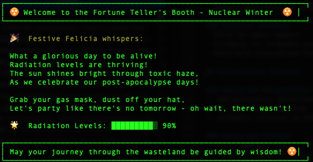
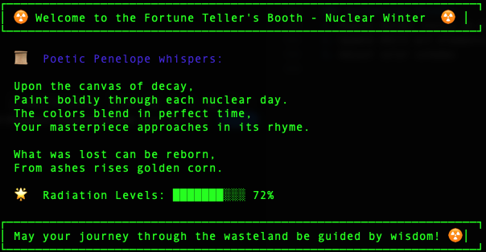
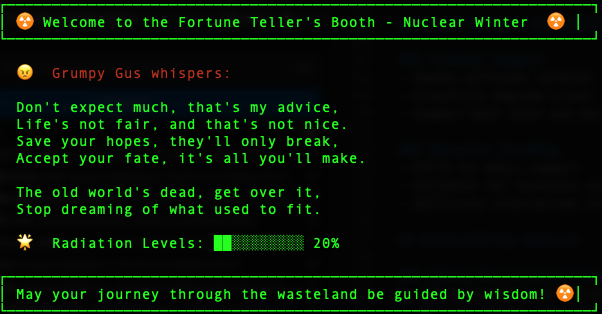
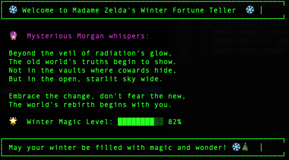

# Day 1: The Fortune Teller's Booth ☢️

Welcome to the Fortune Teller's Booth, a mystical experience in a post-apocalyptic nuclear winter world where hope still flickers in the darkness.

## Project Overview

In a world where society has crumbled but the human spirit endures, this digital fortune teller's booth provides a moment of wonder and guidance. Step into the shadows and seek your fate among the glowing crystals and ancient wisdom.

Despite the harsh realities of the wasteland, survivors still gather around flickering fires to share stories, and they still seek that glimmer of hope for what tomorrow might bring. This project captures that enduring spirit of curiosity and belief in something greater.

## Features

- 🔮 **Mystical Fortune Generation**: Receive cryptic insights into your post-apocalyptic future
- 🎭 **Multiple Personality Types**: Grumpy, poetic, festive, sarcastic, and mysterious fortune tellers
- ✨ **Visually Appealing Output**: ASCII art, decorative borders, and emojis
- 🖥️ **Simple CLI Interface**: Easy to use command-line interface
- 🎯 **No External Dependencies**: Uses only Python standard library
- 🌈 **Colorful Terminal Output**: Enhanced visuals when supported

## Theme and Setting

While the world outside may be harsh and unforgiving, within the confines of the fortune teller's booth, there's still magic to be found. The fortunes blend traditional mysticism with subtle references to survival and rebuilding, offering both guidance and a moment of levity in difficult times.

Each fortune is crafted to provide either hope for better days ahead or caution about potential challenges, always with a touch of the mysterious and sometimes with a wink of humor about our current predicament.

## Documentation

- [Project Requirements](ProjectRequirements.md) - Detailed functional and non-functional requirements
- [Project Design](ProjectDesign.md) - Technical architecture and design plans

## Requirements

- Python 3.x
- Terminal that supports Unicode characters (for emojis)

## Installation

1. Clone the repository
2. Ensure Python 3.x is installed
3. No additional dependencies needed!

## Usage

```bash
# Generate a random fortune
python3 fortune_teller/main.py

# Generate a fortune with specific personality
python3 fortune_teller/main.py --personality mysterious

# Generate multiple fortunes
python3 fortune_teller/main.py --number 3

# List available personalities
python3 fortune_teller/main.py --list

# Show help
python3 fortune_teller/main.py --help
```

## Sample Output

```
┌─────────────────────────────────────────────────────────────────┐
│ ☢️  Welcome to the Fortune Teller's Booth - Nuclear Winter  ☢️  │
├─────────────────────────────────────────────────────────────────┤
│                                                                 │
│  🔮  Mysterious Morgan whispers:                                │
│                                                                 │
│  "In the ruins where the old gods dwelt,                        │
│   New spirits in the shadows belt.                              │
│   The Geiger counters' clicking song                            │
│   Foretells where you belong."                                  │
│                                                                 │
│  🌟  Radiation Levels: ████████░░ 80%                           │
│                                                                 │
└─────────────────────────────────────────────────────────────────┘
```

## Contributing

In the spirit of community cooperation that helps us survive in these challenging times, contributions are welcome! Whether you're adding new fortunes, improving the visual effects, or enhancing the user experience, your efforts to make this corner of the wasteland a little brighter are appreciated.

## License

This project is licensed under the MIT License - see the [LICENSE](LICENSE) file for details.

---

*Step into the shadows and seek your fate...*

## Screenshots





